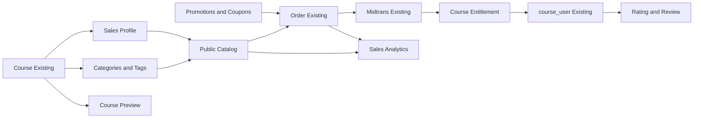

# Roadmap Pengembangan Penjualan Course

## 1. Latar Belakang

Sistem saat ini sudah memiliki fondasi penjualan berupa harga course, katalog publik, order, invoice, integrasi Midtrans, verifikasi pembayaran manual, dan auto-enrollment. Pengembangan berikutnya difokuskan pada kemampuan menemukan, mempromosikan, membeli, dan mengelola hak akses course tanpa membangun ulang sistem pembelajaran yang sudah berjalan.

## 2. Prinsip Desain

1. Pertahankan hierarki `Course -> Lesson -> Content` dan mekanisme progress yang ada.
2. Tambahkan lapisan catalog/commerce melalui tabel dan service baru.
3. `course_user` tetap menjadi enrollment pembelajaran.
4. Order menyimpan snapshot harga pada saat transaksi.
5. Pembayaran dan hak akses sebaiknya dipisahkan agar refund dan pencabutan akses dapat dikelola.
6. Fitur baru harus kompatibel dengan enrollment gratis, token, class, dan assignment admin.
7. Implementasi dilakukan bertahap agar fitur penjualan dasar dapat digunakan lebih dahulu.

## 3. Target Produk

Setelah roadmap selesai, pengguna dapat:

- Menemukan course melalui category, tag, pencarian, dan filter.
- Memahami manfaat, target peserta, instructor, silabus, serta hasil pembelajaran sebelum membeli.
- Melihat preview materi dan review peserta.
- Menggunakan promosi atau kupon yang valid.
- Membayar dan memperoleh akses secara konsisten.
- Mengajukan refund sesuai kebijakan.

Admin dapat:

- Mengelola informasi penjualan tanpa mengubah struktur lesson/content.
- Mengatur category, tag, promosi, dan kupon.
- Memantau funnel penjualan dan pendapatan.
- Melacak sumber hak akses setiap peserta.
- Menangani pembayaran, refund, dan pencabutan akses dengan audit trail.

## 4. Arsitektur Target



## 5. Scope Fase 1: Course Siap Dijual

### 5.1 Category dan Tag

Category digunakan untuk navigasi terstruktur, sedangkan tag digunakan untuk karakteristik fleksibel.

Rancangan tabel:

```text
categories
- id
- parent_id nullable -> categories.id
- name
- slug unique
- description nullable
- is_active
- sort_order
- timestamps

category_course
- category_id -> categories.id
- course_id -> courses.id
- unique(category_id, course_id)

tags
- id
- name
- slug unique
- is_active
- timestamps

course_tag
- course_id -> courses.id
- tag_id -> tags.id
- unique(course_id, tag_id)
```

Aturan:

- Category dapat memiliki parent untuk membentuk hierarki.
- Satu course dapat memiliki beberapa category dan tag.
- Category/tag nonaktif tidak ditampilkan sebagai filter publik.
- Penghapusan category/tag tidak boleh menghapus course.

### 5.2 Sales Profile

**Status: Laravel MVP direalisasikan 7 Oktober 2026.** Pengelolaan tersedia melalui menu admin Penjualan Course yang terpisah dari form akademik, dan data profile digunakan oleh katalog web serta API mobile.

Informasi penjualan dipisahkan dari data inti course melalui relasi satu-ke-satu.

```text
course_sales_profiles
- id
- course_id unique -> courses.id
- slug unique
- headline nullable
- target_audience nullable
- learning_benefits nullable
- requirements nullable
- level nullable
- estimated_duration_minutes nullable
- language nullable
- promo_video_url nullable
- faq json nullable
- seo_title nullable
- seo_description nullable
- sales_status
- published_at nullable
- timestamps
```

Nilai awal `sales_status`:

- `draft`
- `published`
- `hidden`

Course tetap menjadi sumber judul, thumbnail, instructor, silabus, harga dasar, dan status akademik. Sales profile hanya menyimpan atribut pemasaran.

### 5.3 Halaman Detail Penjualan

Halaman katalog minimal menampilkan:

- Judul, headline, thumbnail, dan video promosi.
- Harga normal dan harga akhir.
- Target peserta dan persyaratan.
- Manfaat atau hasil yang diperoleh.
- Tingkat kesulitan, bahasa, dan estimasi durasi.
- Instructor.
- Silabus lesson tanpa membuka konten terkunci.
- Informasi class/batch bila tersedia.
- Sertifikat, tugas, sesi live, dan aturan akses.
- Preview materi.
- FAQ dan kebijakan refund.

### 5.4 Preview Content

**Status: Laravel MVP direalisasikan 9 Oktober 2026.** Admin memilih materi melalui pengaturan Penjualan Course. Preview publik tersedia di web dan API mobile untuk content bertipe `text`, `video`, dan `image`; aktivitas preview tidak membuat progress. Quiz, tugas, feedback, Zoom, dan dokumen tetap terkunci.

Preview dibuat sebagai konfigurasi tambahan tanpa mengubah completion peserta.

```text
course_previews
- id
- course_id -> courses.id
- content_id -> contents.id
- sort_order
- timestamps
- unique(course_id, content_id)
```

Aturan:

- Content harus berasal dari course yang sama.
- Preview hanya memberikan akses baca/tonton.
- Aktivitas preview tidak membuat record completion.
- File restricted tetap disajikan melalui controller yang tervalidasi, bukan URL storage mentah.

### 5.5 Pencarian, Filter, dan Sorting

Filter minimum:

- Category.
- Tag.
- Level.
- Harga gratis/berbayar.
- Program regular/AVPN.
- Instructor.
- Jadwal atau batch aktif.

Sorting minimum:

- Terbaru.
- Harga terendah/tertinggi.
- Terpopuler.
- Rating tertinggi setelah review tersedia.

Database search sudah cukup untuk tahap awal. Search engine terpisah hanya diperlukan jika jumlah course atau trafik meningkat signifikan.

### 5.6 Penguatan Snapshot Order

Order tidak boleh bergantung pada harga course terbaru setelah transaksi dibuat.

Kolom yang perlu tersedia atau dipastikan tersimpan:

```text
base_amount
discount_amount
fee_amount
amount
currency
coupon_code nullable
pricing_snapshot json nullable
```

`pricing_snapshot` dapat menyimpan nama course, harga awal, aturan diskon, metode pembayaran, dan versi perhitungan biaya pada waktu checkout.

## 6. Scope Fase 2: Meningkatkan Konversi

### 6.1 Promosi

```text
course_promotions
- id
- course_id -> courses.id
- name
- discount_type (fixed|percentage)
- discount_value
- starts_at
- ends_at
- usage_limit nullable
- per_user_limit nullable
- is_active
- timestamps
```

Aturan:

- Promosi hanya berlaku pada periode aktif.
- Harga akhir tidak boleh negatif.
- Persentase dibatasi maksimal 100%.
- Harga yang digunakan tetap disimpan sebagai snapshot order.

### 6.2 Kupon

**Status MVP: diimplementasikan untuk checkout web course tunggal.** Mendukung kill switch
environment, toggle admin, kupon global/per-course, reservasi kuota saat order dibuat,
serta pelepasan untuk order unpaid yang cancelled/expired/failed. Bundle dan promosi
terjadwal tetap berada pada fase berikutnya.

```text
coupons
- id
- code unique
- discount_type
- discount_value
- minimum_amount nullable
- usage_limit nullable
- per_user_limit nullable
- starts_at nullable
- expires_at nullable
- is_active
- timestamps

coupon_course
- coupon_id -> coupons.id
- course_id -> courses.id

coupon_redemptions
- id
- coupon_id -> coupons.id
- order_id -> orders.id
- user_id -> users.id
- discount_amount
- redeemed_at
- unique(coupon_id, order_id)
```

Validasi kupon dan pembuatan order harus berada dalam transaksi untuk mencegah penggunaan melebihi limit.

### 6.3 Rating dan Review

```text
course_reviews
- id
- course_id -> courses.id
- user_id -> users.id
- order_id nullable -> orders.id
- rating
- review nullable
- verified_purchase
- status
- published_at nullable
- timestamps
- unique(course_id, user_id)
```

Aturan yang disarankan:

- Rating berada pada rentang 1-5.
- Hanya user yang terdaftar pada course yang dapat membuat review.
- Review baru diizinkan setelah progress minimum, misalnya 20%.
- `verified_purchase` hanya diberikan jika ada order paid milik user tersebut.
- Admin dapat menyetujui, menyembunyikan, atau menolak review tanpa mengubah isi asli.

### 6.4 Merchandising

Kemampuan katalog tambahan:

- Featured course.
- Badge `Baru`, `Terlaris`, atau `Rekomendasi`.
- Related course berdasarkan category dan tag.
- Section course populer dan course terbaru.

Badge `Terlaris` sebaiknya dihitung dari order paid, bukan dimasukkan manual. Badge editorial seperti `Rekomendasi` dapat dikelola admin.

### 6.5 Sales Funnel Analytics

Event minimum:

```text
catalog_viewed
course_viewed
checkout_started
order_created
payment_paid
enrollment_granted
course_started
course_completed
refund_requested
refund_completed
```

Metrik minimum:

- View-to-checkout conversion.
- Checkout-to-paid conversion.
- Pendapatan per course/category.
- Metode pembayaran paling efektif.
- Penggunaan dan efektivitas kupon.
- Refund rate.
- Completion rate untuk pembeli.
- Course yang banyak dilihat tetapi conversion rendah.

Analytics dapat dimulai dari agregasi data aplikasi yang sudah ada. Tabel event khusus ditambahkan hanya jika kebutuhan funnel tidak dapat dipenuhi dari order dan activity log.

## 7. Scope Fase 3: Penguatan Hak Akses

### 7.1 Course Entitlement

Entitlement mencatat alasan dan periode user berhak mengakses course. Enrollment tetap disimpan di `course_user` untuk kompatibilitas dengan sistem pembelajaran.

```text
course_entitlements
- id
- user_id -> users.id
- course_id -> courses.id
- order_id nullable -> orders.id
- source
- status
- starts_at
- expires_at nullable
- revoked_at nullable
- revoked_by nullable -> users.id
- revocation_reason nullable
- metadata json nullable
- timestamps
```

Nilai `source` yang direncanakan:

- `purchase`
- `free_enrollment`
- `course_token`
- `class_token`
- `enrollment_code`
- `admin_assignment`
- `corporate`

Nilai `status`:

- `pending`
- `active`
- `expired`
- `revoked`
- `refunded`

Alur akses:

```text
Sumber akses tervalidasi
-> Buat/aktifkan entitlement secara idempotent
-> Attach course_user bila belum ada
-> Pertahankan progress yang sudah tersimpan
```

Entitlement memungkinkan akses dicabut tanpa menghapus progress. Jika user memperoleh akses kembali, progress lama dapat dilanjutkan.

### 7.2 Refund

```text
refund_requests
- id
- order_id -> orders.id
- user_id -> users.id
- reason
- status
- requested_amount
- approved_amount nullable
- provider_reference nullable
- reviewed_by nullable -> users.id
- reviewed_at nullable
- completed_at nullable
- timestamps
```

Status awal:

- `requested`
- `under_review`
- `approved`
- `rejected`
- `processing`
- `refunded`
- `failed`

Keputusan bisnis yang harus ditetapkan sebelum implementasi:

- Batas waktu pengajuan refund.
- Batas progress maksimal agar refund dapat diajukan.
- Perlakuan terhadap service fee.
- Apakah refund parsial diizinkan.
- Kapan entitlement dicabut.
- Apakah sertifikat yang sudah terbit ikut dibatalkan.

## 8. Fitur yang Ditunda

Fitur berikut tidak termasuk MVP:

- Subscription bulanan.
- Bundle beberapa course. **Laravel MVP direalisasikan 3 Oktober 2026**; Flutter tetap ditunda.
- Affiliate atau referral commission.
- Revenue sharing instructor.
- Loyalty point.
- Dynamic pricing.
- Marketplace multi-vendor.
- Recommendation berbasis AI.

Fitur tersebut baru dipertimbangkan setelah alur order, payment, entitlement, dan refund stabil.

## 9. Urutan Implementasi

### Fase 0: Stabilkan Fondasi Pembayaran

- Audit idempotency webhook Midtrans.
- Pastikan order menyimpan snapshot harga.
- Pastikan enrollment tidak dapat dibuat dua kali.
- Dokumentasikan status order dan transisinya.
- Tambahkan test untuk paid, pending, expired, rejected, dan verifikasi manual.

### Fase 1: Catalog MVP

1. Category dan tag.
2. Sales profile.
3. Halaman detail penjualan.
4. Preview content.
5. Search, filter, dan sorting.
6. Informasi kebijakan akses/refund pada checkout.

### Fase 2: Conversion

1. Promosi terjadwal.
2. Kupon.
3. Rating dan review.
4. Featured/related course.
5. Funnel analytics.

### Fase 3: Access Management

1. Course entitlement.
2. Migrasi sumber enrollment existing menjadi entitlement tanpa menghapus pivot lama.
3. Refund request dan approval.
4. Sinkronisasi refund dengan entitlement.

### Fase 4: Ekspansi Bisnis

- Bundle, corporate purchase, subscription, atau affiliate berdasarkan kebutuhan bisnis tervalidasi.

## 10. Definition of Done

Setiap fitur dianggap selesai jika:

- Migration memiliki foreign key, unique index, dan index pencarian yang sesuai.
- Authorization web dan mobile diterapkan.
- Validasi konsisten pada controller/service.
- Operasi pembayaran dan enrollment bersifat idempotent.
- Audit trail tersedia untuk perubahan sensitif.
- Test mencakup happy path, akses ilegal, kondisi kedaluwarsa, dan request berulang.
- UI berfungsi pada desktop dan mobile.
- Dokumentasi ERD, status, dan aturan bisnis diperbarui.
- Tidak mengubah progress atau enrollment existing secara destruktif.

## 11. Keputusan yang Perlu Dikonfirmasi

Sebelum implementasi dimulai, pimpinan perlu menetapkan:

1. Apakah akses course berlaku selamanya atau memiliki masa aktif.
2. Apakah pembelian terkait langsung ke course atau harus memilih class/batch.
3. Kebijakan refund dan batas progress peserta.
4. Apakah harga dan diskon sudah termasuk pajak.
5. Apakah instructor memperoleh komisi.
6. Apakah satu akun dapat membeli course sebagai hadiah untuk akun lain.
7. Course AVPN tidak boleh dijual secara publik; commerce hanya menerima course Regular.
8. Apakah sertifikat tetap valid setelah refund atau pencabutan akses.

## 12. Rekomendasi Awal

Mulai dari Fase 0 dan Fase 1. Category dan tag penting untuk discoverability, tetapi sales profile, preview, informasi checkout, serta snapshot harga lebih menentukan apakah katalog aman dan efektif digunakan untuk berjualan. Entitlement sebaiknya dirancang sejak awal, tetapi implementasinya dapat dilakukan setelah catalog MVP dan alur pembayaran stabil.
