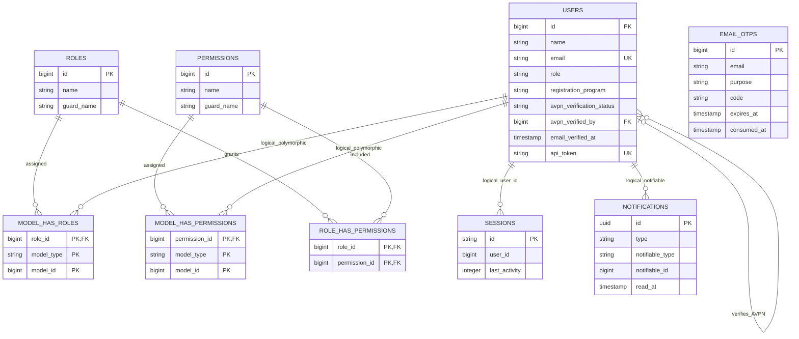
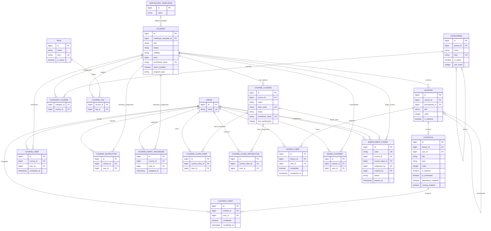
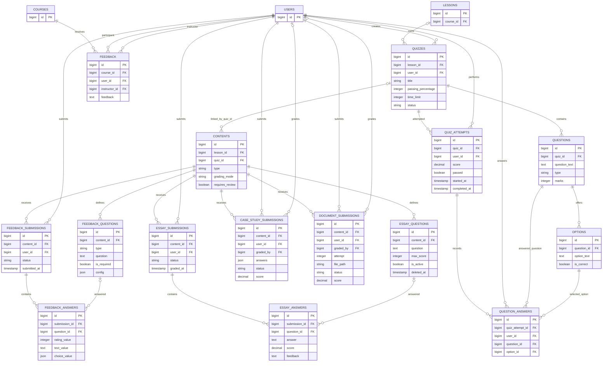
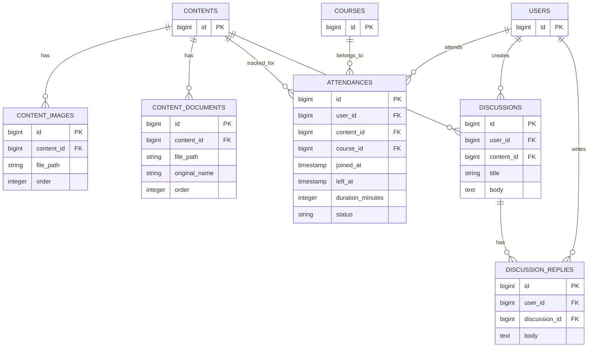
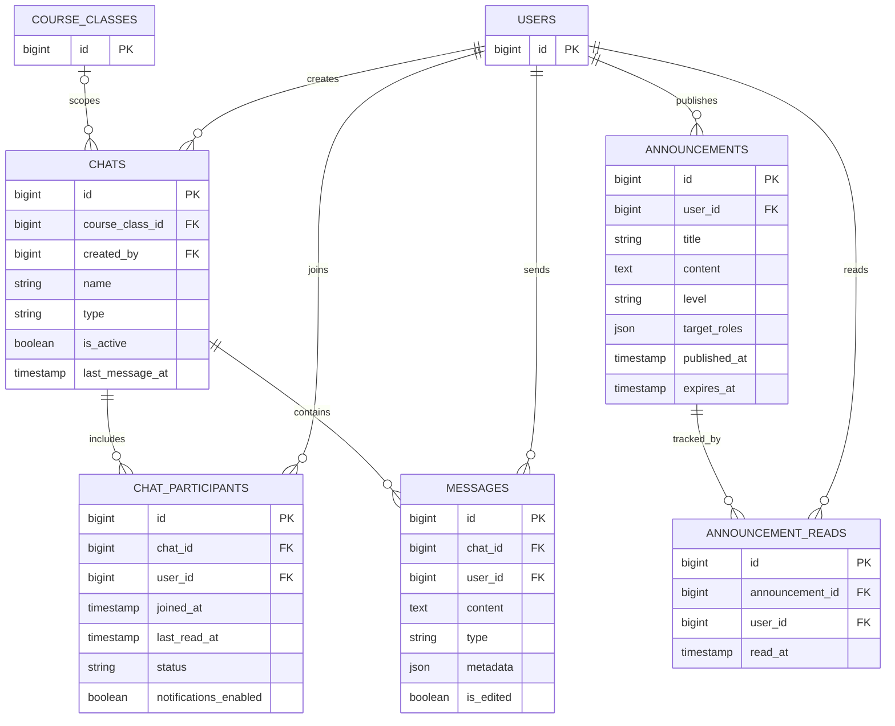
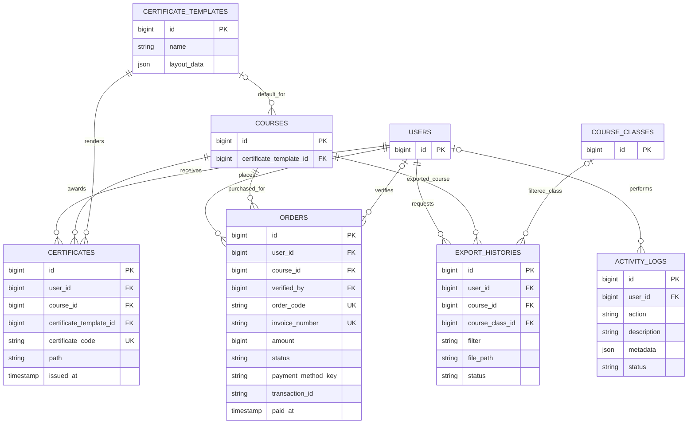
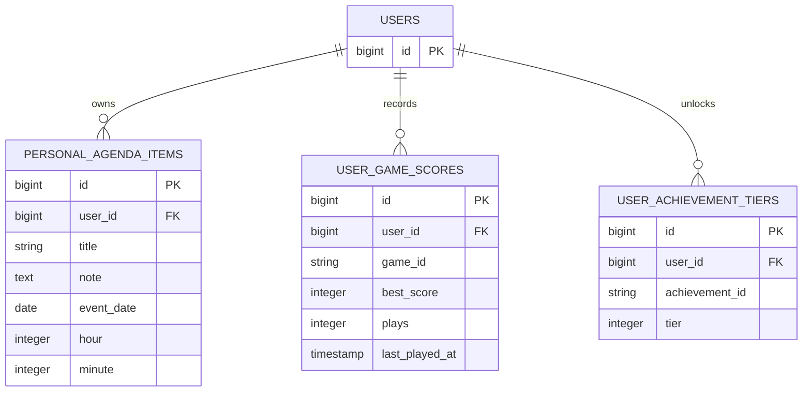

# Entity Relationship Diagram

## Notasi

| Simbol | Arti |
|---|---|
| `||` | Tepat satu |
| `o|` | Nol atau satu |
| `o{` | Nol atau banyak |
| `PK` | Primary key |
| `FK` | Foreign key |
| `UK` | Unique key |

ERD dibagi per domain agar relasi dapat dibaca tanpa menghasilkan satu diagram yang terlalu besar.

## 1. Identity dan RBAC

Catatan:

- `model_has_roles`, `model_has_permissions`, dan `notifications` bersifat polymorphic.
- `sessions.user_id` memiliki index tetapi bukan foreign key.
- `email_otps` dan `password_reset_tokens` berelasi ke pengguna melalui email, bukan foreign key.
- Field `users.role` adalah field legacy; otorisasi utama menggunakan Spatie Permission.

## 2. Kursus, Kelas, dan Enrollment

Constraint unik penting:

- `course_user(course_id, user_id)`
- `course_instructor(course_id, user_id)`
- `course_event_organizer(course_id, user_id)`
- `course_class_user(course_class_id, user_id)`
- `course_class_instructor(course_class_id, user_id)`
- `lesson_user(lesson_id, user_id)`
- `content_user(content_id, user_id)`
- `saved_courses(user_id, course_id)`
- `categories.slug`
- `tags.slug`
- `category_course(category_id, course_id)`
- `course_tag(course_id, tag_id)`

Saat category induk dihapus, `categories.parent_id` pada anak menjadi `null`. Penghapusan category atau tag hanya menghapus relasi pivot dan tidak menghapus course. Taxonomy nonaktif tetap dapat tersimpan pada course, tetapi tidak ditampilkan atau diterima sebagai filter katalog publik.

## 3. Asesmen

## 4. Konten, Kehadiran, dan Diskusi

`attendances` unik per `(user_id, content_id)`. `course_id` disimpan secara denormalisasi untuk reporting dan harus konsisten dengan jalur `content -> lesson -> course` pada level aplikasi.

## 5. Komunikasi

## 6. Sertifikat, Pembayaran, dan Reporting

## 7. Fitur Personal Mobile

`game_id` dan `achievement_id` menunjuk registry di aplikasi mobile, bukan tabel master di database.

## Katalog Tabel

| Domain | Tabel |
|---|---|
| Identity/Auth | `users`, `password_reset_tokens`, `sessions`, `email_otps` |
| RBAC | `roles`, `permissions`, `model_has_roles`, `model_has_permissions`, `role_has_permissions` |
| Course | `courses`, `lessons`, `contents`, `course_classes` |
| Course taxonomy | `categories`, `tags`, `category_course`, `course_tag` |
| Membership | `course_user`, `course_instructor`, `course_event_organizer`, `course_class_user`, `course_class_instructor`, `saved_courses` |
| Progress | `lesson_user`, `content_user`, `attendances` |
| Enrollment | `enrollment_codes` |
| Quiz | `quizzes`, `questions`, `options`, `quiz_attempts`, `question_answers` |
| Essay | `essay_questions`, `essay_submissions`, `essay_answers` |
| Submission | `case_study_submissions`, `document_submissions` |
| Survey | `feedback_questions`, `feedback_submissions`, `feedback_answers`, `feedback` |
| Content assets | `content_images`, `content_documents` |
| Discussion | `discussions`, `discussion_replies` |
| Chat | `chats`, `chat_participants`, `messages` |
| Announcement | `announcements`, `announcement_reads`, `notifications` |
| Certificate | `certificate_templates`, `certificates` |
| Commerce | `orders` |
| Reporting/Audit | `export_histories`, `activity_logs` |
| Personal | `personal_agenda_items`, `user_game_scores`, `user_achievement_tiers` |
| Infrastructure | `cache`, `cache_locks`, `jobs`, `job_batches`, `failed_jobs` |

## Aturan Integritas di Level Aplikasi

Aturan berikut belum seluruhnya dipaksa oleh constraint database:

1. `enrollment_codes` seharusnya menunjuk tepat satu target: course atau class.
2. `contents.quiz_id` seharusnya menunjuk quiz pada lesson yang sesuai.
3. `question_answers` harus konsisten antara attempt, user, quiz, question, dan option.
4. `attendances.course_id` harus sama dengan course dari content terkait.
5. Satu submission seharusnya hanya memiliki satu jawaban per pertanyaan.
6. Tanggal akhir class, course, dan jadwal content tidak boleh lebih awal dari tanggal mulai.
7. Sertifikat diterbitkan hanya jika syarat kelulusan dan review konten wajib terpenuhi.
8. Enrollment berbayar hanya diberikan setelah status pembayaran valid atau verifikasi admin selesai.
9. Hierarki category tidak boleh menjadikan category sebagai induk dirinya sendiri atau salah satu turunannya.

## Ketidaksesuaian Model yang Perlu Diperhatikan

Temuan ini didokumentasikan agar ERD fisik tidak disalahartikan sebagai perilaku model yang selalu benar:

- `User::completedLessons()` menggunakan pivot `status`, sedangkan tabel `lesson_user` memiliki kolom boolean `completed`.
- `Course::quizzes()` mengasumsikan `quizzes.course_id`, tetapi schema final menggunakan `quizzes.lesson_id`.
- `Quiz::content()` adalah `hasOne`, sedangkan `contents.quiz_id` tidak unik sehingga database mengizinkan banyak content untuk satu quiz.
- `essay_questions.deleted_at` tersedia, tetapi model `EssayQuestion` tidak memakai trait `SoftDeletes`.
- `User::$fillable` memuat `phone` dan `monthly_income`, tetapi kolom tersebut tidak ditemukan pada migration repository.
