# System Design LMS BASS Training Center

## 1. Tujuan dan Ruang Lingkup

Sistem adalah LMS untuk pengelolaan program pelatihan melalui web dan aplikasi mobile. Sistem mencakup pembuatan kursus, enrollment, konsumsi konten, asesmen, grading, kehadiran, diskusi, chat real-time, pembayaran, sertifikat, reporting, dan administrasi pengguna.

Dokumen ini merepresentasikan implementasi aktual di repository. Detail struktur data tersedia di [ERD.md](ERD.md).

## 2. Aktor

| Aktor | Tanggung jawab utama |
|---|---|
| Participant | Enroll, mempelajari konten, mengerjakan asesmen, berdiskusi, dan memperoleh sertifikat |
| Instructor | Mengelola course yang ditugaskan, membuat konten, menilai submission, dan memantau progres |
| Event Organizer | Memantau course, peserta, attendance, reporting, dan sertifikat sesuai permission |
| Super Admin | Mengelola seluruh data, RBAC, pembayaran, AVPN, bulk operation, dan konfigurasi akademik |
| Midtrans | Memproses transaksi dan mengirim webhook status pembayaran |
| Mail provider | Mengirim OTP dan reset password |
| Queue worker | Menjalankan logging, export, bulk completion, dan proses sertifikat asynchronous |
| Reverb server | Menyampaikan event chat melalui WebSocket |

## 3. System Context

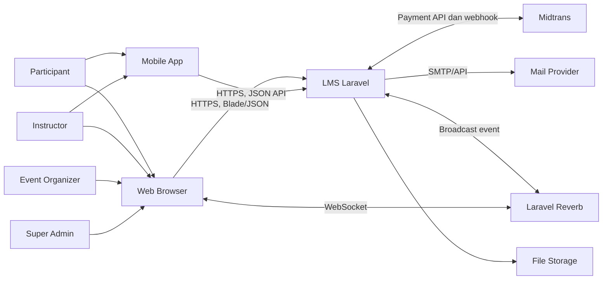

## 4. Container dan Runtime Architecture

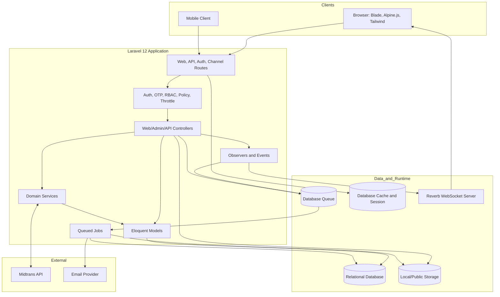

### Pola Arsitektur

- Modular monolith berbasis MVC dengan service layer untuk logika kompleks.
- Eloquent Active Record untuk persistence dan relasi domain.
- Route middleware dan Spatie Permission untuk coarse-grained authorization.
- Policy dan pemeriksaan membership di controller untuk object-level authorization.
- Observer/event untuk notifikasi dan side effect submission.
- Database queue untuk pekerjaan yang tidak harus selesai dalam request utama.
- Shared database antara kanal web dan mobile sehingga perubahan tersinkron langsung.

## 5. Komponen Aplikasi

| Layer | Komponen | Tanggung jawab |
|---|---|---|
| Presentation | Blade, Alpine.js, Tailwind, Summernote | UI web dan interaksi browser |
| API | Controller di `app/Http/Controllers/Api` | JSON API untuk aplikasi mobile dan chat |
| Routing | `routes/web.php`, `routes/api.php`, `routes/auth.php`, `routes/channels.php` | Entry point HTTP dan channel authorization |
| Security | Middleware, Policy, Gate, Spatie Permission | Authentication, authorization, throttle, dan response shaping |
| Domain | Controller, Service, Model, Observer | Aturan course, enrollment, assessment, payment, dan certificate |
| Async | Jobs dan database queue | Export, audit log, bulk completion, bulk certificate |
| Real-time | Reverb, Echo, `MessageSent`, `UserTyping` | Chat dan indikator mengetik |
| Persistence | Database relasional | Data bisnis, session, cache, queue, notification |
| File | Disk `local` dan `public` | Dokumen, gambar, export, avatar, dan PDF sertifikat |

## 6. Domain Boundary

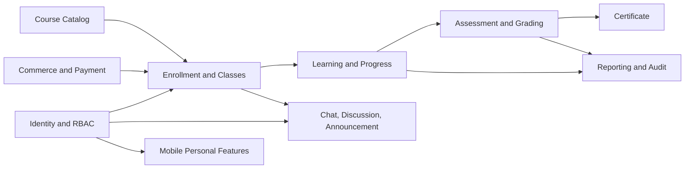

## 7. Authentication dan Authorization

### Web

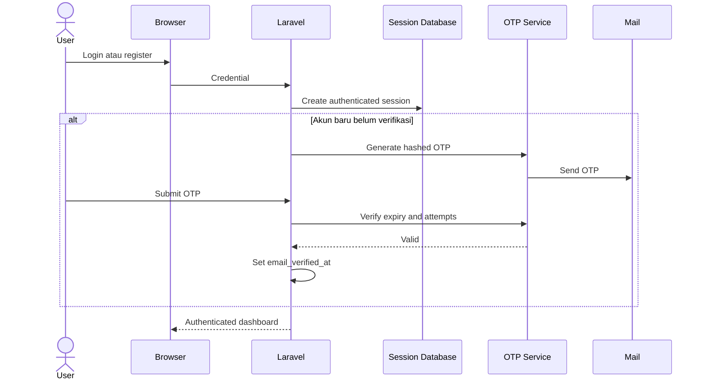

Web menggunakan session authentication. Route utama LMS memakai `auth` dan `verified`, kemudian permission middleware serta policy sesuai resource.

### Mobile

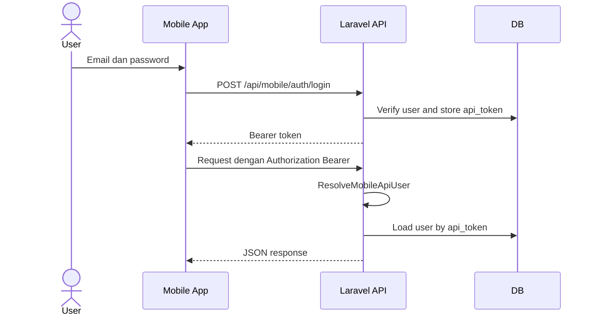

Mobile API aktif menggunakan custom bearer token pada `users.api_token`, bukan Sanctum. Route chat legacy di `web.php` masih menyebut `auth:sanctum` dan perlu diperlakukan sebagai jalur terpisah/legacy.

### Model Otorisasi

1. Route middleware memeriksa role atau permission.
2. Policy memeriksa kemampuan terhadap resource tertentu.
3. Controller memeriksa assignment, enrollment, kepemilikan submission, atau partisipasi chat.
4. `super-admin` memperoleh global bypass melalui Gate.

## 8. Alur Enrollment

Sistem mendukung enrollment gratis, token course, token class, kode sekali pakai, assignment admin, dan hasil pembayaran.

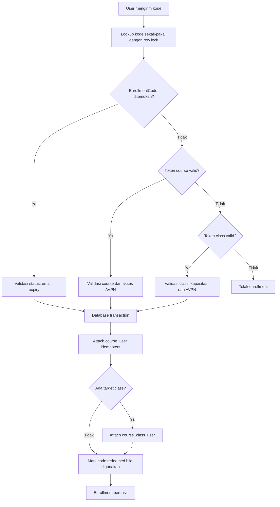

Program AVPN hanya dapat diakses jika `avpn_verification_status` memenuhi syarat aplikasi.

## 9. Akses Konten dan Progress

Urutan utama adalah `Course -> Lesson -> Content`. Lesson dan content memiliki `order`, prerequisite, optional flag, scheduling, serta aturan completion.

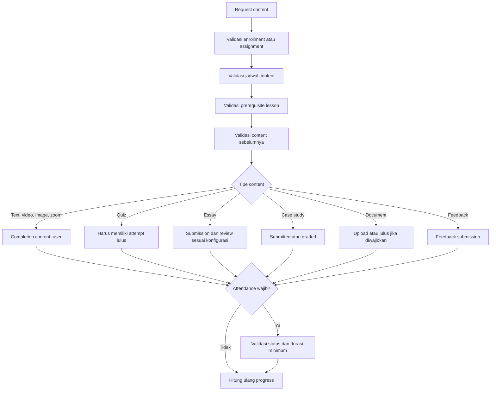

Konten optional tidak menghalangi pembukaan konten berikutnya. Completion tersimpan tersebar pada pivot progress dan tabel asesmen, sehingga perhitungan progress harus selalu melalui aturan domain yang sama.

## 10. Asesmen dan Grading

### Quiz Otomatis

```mermaid
sequenceDiagram
    actor Participant
    participant App
    participant QuizController
    participant DB

    Participant->>App: Mulai quiz
    App->>QuizController: Start attempt
    QuizController->>DB: Create/reuse QuizAttempt
    QuizController-->>App: Questions dan timer
    Participant->>App: Pilih jawaban
    App->>QuizController: Submit attempt
    QuizController->>DB: Compare Option.is_correct
    QuizController->>DB: Save QuestionAnswer dan score
    QuizController->>DB: Set passed berdasarkan passing_percentage
    QuizController-->>App: Hasil
```

### Asesmen Manual

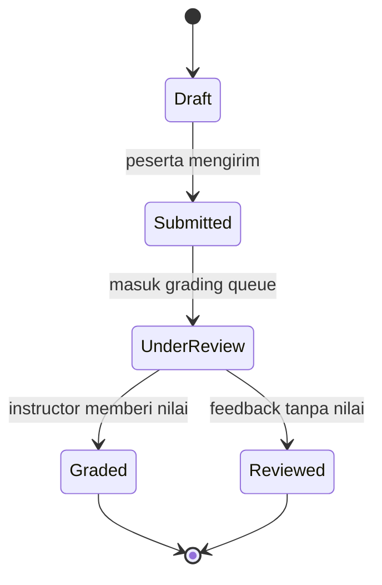

Observer submission membuat notifikasi untuk instructor dan participant. Essay dapat dinilai per pertanyaan atau secara keseluruhan, sedangkan case study dan document menyimpan grader pada `graded_by`.

## 11. Pembayaran

Commerce hanya berlaku untuk course dengan `program_type=regular`. Pengaturan katalog, harga, dan sales profile dikelola melalui menu admin Penjualan Course, terpisah dari form akademik. Course AVPN tidak boleh muncul pada katalog, bundle, learning path publik, kupon, atau checkout.

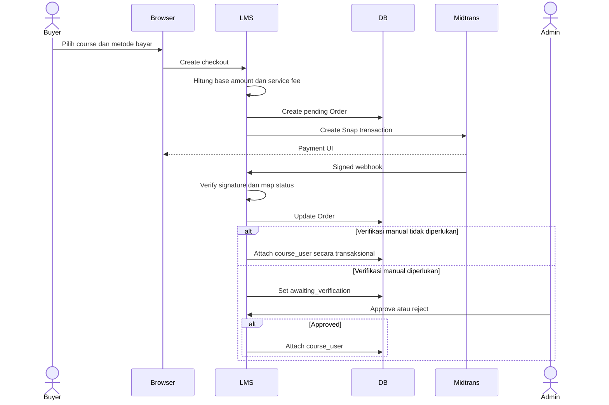

Redirect browser setelah pembayaran bukan bukti pembayaran. Enrollment bergantung pada webhook terverifikasi atau status server-side dan, jika dikonfigurasi, persetujuan admin.

## 12. Sertifikat

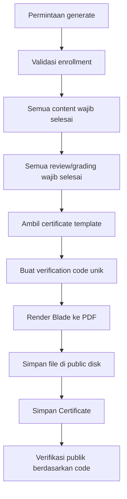

Bulk generation dan ZIP download dijalankan melalui queue atau status file sementara, tergantung operasi.

## 13. Chat dan Notifikasi Real-time

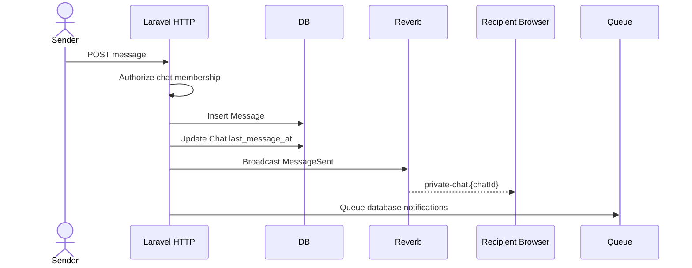

Authorization channel memeriksa bahwa user adalah participant chat. Laravel Echo menggunakan protokol Pusher untuk berkomunikasi dengan Reverb.

## 14. Async Processing

Queue menggunakan database driver. Proses asynchronous utama:

| Job | Fungsi |
|---|---|
| `LogActivityJob` | Menyimpan audit aktivitas request |
| `ExportCourseParticipantsJob` | Membuat export participant |
| `BulkForceCompleteJob` | Menandai completion secara massal |
| `BulkGenerateCertificatesJob` | Membuat sertifikat massal |
| `BulkDownloadCertificatesJob` | Menyiapkan ZIP sertifikat |

Worker harus dijalankan terpisah dari web process. Kegagalan tersedia pada `failed_jobs` dan perlu dimonitor.

## 15. Storage Design

| Disk/lokasi | Data | Akses |
|---|---|---|
| `storage/app/private` | Export dan file internal | Melalui controller/temporary URL |
| `storage/app/public` | Avatar, gambar konten, thumbnail, sertifikat | Melalui `/storage` setelah `storage:link` |
| Database | Metadata file dan path | Melalui model domain |
| `storage/app/temp` | Status/ZIP bulk sementara | Internal, perlu cleanup |

S3 tersedia di konfigurasi, tetapi sebagian besar feature secara eksplisit menggunakan disk local/public. Horizontal scaling memerlukan shared object storage atau shared filesystem.

## 16. Deployment Topology

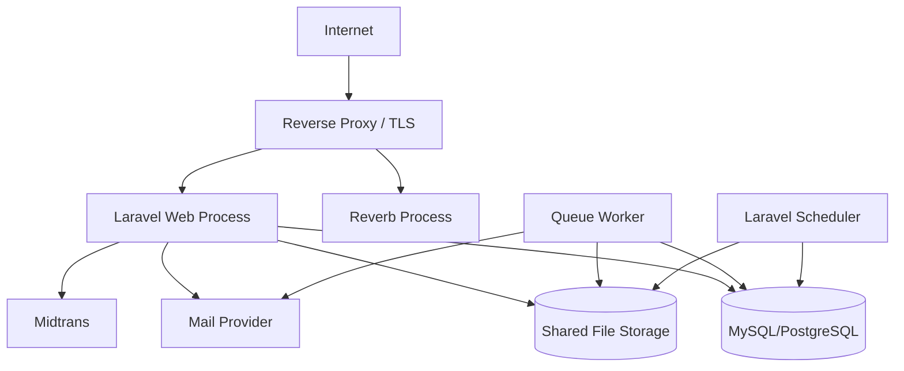

Process minimum production:

1. Web server PHP/Laravel.
2. Queue worker dengan restart dan retry policy.
3. Reverb server untuk chat real-time.
4. Scheduler yang menjalankan `schedule:run` setiap menit.
5. Database dan backup terjadwal.
6. Shared storage jika memakai lebih dari satu instance aplikasi.

## 17. Security Design

Kontrol yang sudah ada:

- Password hashing melalui Laravel authentication.
- OTP disimpan dalam bentuk hash, memiliki expiry, cooldown, dan attempt counter.
- CSRF untuk web; hanya webhook Midtrans yang dikecualikan.
- Signature validation pada webhook Midtrans.
- Permission middleware, policy, Gate, dan membership check.
- Rate limiting untuk login, register, OTP, upload, autosave, dan handoff mobile.
- Handoff mobile-web memakai token acak sekali pakai, hash cache, TTL singkat, dan `Cache::pull`.
- Sensitive password field difilter dari activity logging.
- Private channel chat membutuhkan authorization.

Area yang perlu diperkuat:

- Hash `users.api_token` atau pindahkan ke token store yang mendukung rotasi dan multi-device.
- Hilangkan/rapikan route `auth:sanctum` legacy jika Sanctum memang tidak digunakan.
- Terapkan pemeriksaan enrollment dan path allowlist yang ketat pada endpoint download dokumen mobile.
- Audit seluruh metadata activity log agar token dan credential lain tidak ikut tersimpan.
- Tambahkan constraint dan validasi konsistensi lintas tabel seperti yang dicatat di ERD.

## 18. Non-Functional Requirements

| Aspek | Target desain |
|---|---|
| Availability | Web tetap melayani request saat worker/realtime sementara gagal; pekerjaan async dapat di-retry |
| Consistency | Transaksi dan row lock untuk payment, enrollment code, dan operasi idempotent |
| Performance | Eager loading untuk halaman course/progress, index pada FK/status, proses bulk melalui queue |
| Scalability | Web process stateless kecuali file lokal; gunakan shared storage untuk multi-instance |
| Security | Least privilege, signed webhook, CSRF, throttle, audit, dan authorization per resource |
| Observability | Application log, `activity_logs`, queue failure, health endpoint `/up`, serta monitoring worker |
| Recoverability | Backup database dan file sertifikat/submission; prosedur restore harus diuji |

## 19. Risiko dan Technical Debt Prioritas

### Prioritas Tinggi

1. `User::completedLessons()` tidak sesuai schema pivot dan dapat menghasilkan query ke kolom yang tidak ada.
2. `Course::quizzes()` mengandalkan `quizzes.course_id` yang sudah dihapus.
3. Endpoint dokumen mobile menerima path dinamis dan perlu validasi authorization/path yang lebih ketat.
4. Route API/chat legacy menggunakan Sanctum walaupun dependency dan trait token tidak terlihat aktif.
5. Ada route duplikat dan route order yang berpotensi konflik, termasuk `/chat/{chat}` sebelum `/chat/search`.

### Prioritas Menengah

1. Logic pembuatan sertifikat tersebar di beberapa controller sehingga berisiko berbeda perilaku.
2. Activity logging melalui middleware dan callback model dapat menghasilkan log ganda.
3. `EssayQuestion` memiliki `deleted_at` tetapi model tidak menggunakan `SoftDeletes`.
4. Beberapa konsistensi domain tidak dipaksa oleh unique/check constraint database.
5. Status bulk process tertentu disimpan sebagai file lokal dan tidak aman untuk multi-instance tanpa shared storage.

### Prioritas Operasional

1. Pastikan queue worker, Reverb, dan scheduler dimonitor dan otomatis restart.
2. Monitor pertumbuhan tabel `jobs`, `failed_jobs`, `activity_logs`, `notifications`, dan `sessions`.
3. Terapkan lifecycle cleanup untuk export, ZIP sementara, OTP kedaluwarsa, dan file orphan.
4. Uji restore gabungan database dan file storage secara berkala.

## 20. Sumber Kebenaran

Urutan sumber yang digunakan saat terjadi perbedaan dokumentasi:

1. Migration dan constraint database.
2. Route serta middleware aktif di `bootstrap/app.php`.
3. Model, policy, controller, service, observer, event, dan job.
4. Konfigurasi aplikasi dan environment deployment.
5. Dokumen lama di folder `docs`.

Dokumen lama yang menyatakan mobile API menggunakan Sanctum atau tidak memiliki `routes/api.php` sudah tidak sesuai dengan implementasi aktif. `bootstrap/app.php` saat ini mendaftarkan `routes/api.php`, dan mobile API menggunakan middleware `mobile.api.user`.
